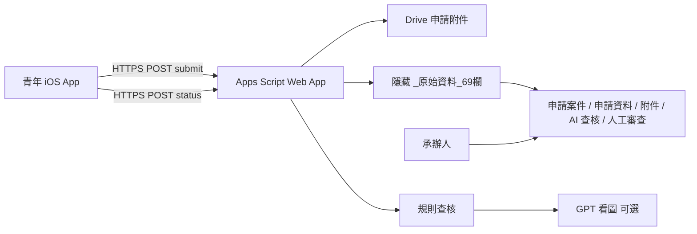

# 梅竹通

新竹市「AI 領航青年數位工具補助」的**競賽原型**：青年用 iOS App 填寫官方欄位、附上文件並一次送出；承辦人在 Google 試算表審查。AI 只提出可追溯的查核**建議**，**不自動核准、駁回或核定金額**。

本 App **未連接市府正式申辦系統**，也不上架 App Store。不得對外宣稱可正式受理申請。

官方公開說明：[新竹市政府服務公告 id=1323](https://dgservice.hccg.gov.tw/)（服務公告編號 1323）。

---

## 這份專案做什麼、不做什麼

**做：**

- 青年端逐步填完適用欄位與附件，按一次「確認送出」。
- 收件服務把欄位寫進試算表，附件存 Google Drive，儲存格只放連結。
- 送件後立刻跑確定性規則查核；若已設定 OpenAI 金鑰，再對身分證、收據、切結書看圖。
- 承辦人在試算表選「待審／需補件／核准／駁回」；青年在 App「案件」下拉讀回**自己的**案件狀態。
- 同一筆送件重試不會新增第二列。沒有收件憑證時，送出會明確失敗，不會假裝已同步。

**不做：**

- 不做 Web 承辦工作台。
- 不讓青年手填 API 網址或金鑰。
- 不把照片、PDF 塞進儲存格。
- 不把 AI 建議當成核定結果；不把內部備註顯示給申請人。
- 不做手機推播。
- 不把 `.env`、`CLIENT_KEY`、`OPENAI_API_KEY`、`Config/Secrets.local.xcconfig` 提交到 Git。

---

## 整體流程



1. 青年在 App 填「申請人與資格 → AI 工具與購買 → 應備文件 → AI 資安宣導 → 摘要與送出」。
2. 按「確認送出」後，App 把 JSON（含 Base64 附件）送到固定 HTTPS 收件網址，並帶測試用 `clientKey`。
3. 收件程式檢查憑證、寫入隱藏 69 欄底稿、同步五個可見分頁、把附件放到 Drive「梅竹通申請附件」。
4. 同一請求內先跑規則查核（只填「AI 查核」欄），有金鑰再跑 GPT 看圖。人工審查決定維持「待審」。
5. 承辦人看顏色與疑點，自行點選或用選單批次寫入核准／補件／駁回。
6. 青年在「案件」下拉，App 用案件編號 + 送件憑證查自己的狀態與承辦公開說明。

---

## 儲存庫結構

先看資料夾名稱就能對到角色：

```
MeiZhuTong-Sheets/
├── YouthAISubsidy/                 # iOS App
│   ├── App/                        # 啟動、四個分頁根
│   ├── Screens/                    # 青年看得到的畫面
│   │   ├── Home/                   # 申請首頁、送 20 筆
│   │   ├── Apply/                  # 填寫五步
│   │   ├── Cases/                  # 我的案件
│   │   └── About/                  # 說明
│   ├── Design/                     # 顏色、共用元件、案件顯示文字
│   ├── Domain/                     # 欄位契約、驗證、補助試算
│   ├── Data/                       # 送件、草稿、OCR、連線狀態
│   ├── Content/                    # 宣導文案、合成測試資料
│   └── Assets.xcassets/            # 圖示、海報、20 筆資料集
├── YouthAISubsidyTests/            # 單元測試（資料夾對齊 App）
├── YouthAISubsidyUITests/          # UI 測試
├── sheets/                         # 試算表 Apps Script（clasp）
│   ├── Schema.gs                   # 69 欄、顏色
│   ├── FiveTabLayout.gs            # 五個可見分頁
│   ├── Server.gs                   # 收件與人工決定
│   ├── AiAudit.gs                  # AI 建議與選單
│   └── appsscript.json
├── scripts/
│   ├── tests/                      # 不連網的試算表測試
│   └── generate/                   # 20 筆／5 萬筆合成資料
├── Config/                         # Xcode 金鑰範本（真金鑰放 Secrets.local.xcconfig）
├── project.yml
├── Makefile
└── docs/                           # 簡報（非執行必要）
```

| 青年看到的 | 資料夾 |
| --- | --- |
| 申請首頁 | `Screens/Home/` |
| 填寫精靈五步 | `Screens/Apply/` |
| 我的案件 | `Screens/Cases/` |
| 說明 | `Screens/About/` |
| 宣導卡文案 | `Content/AwarenessMaterial.swift` |

| 試算表檔 | 責任 |
| --- | --- |
| `Schema.gs` | 69 欄標題、淡色、AI 分欄 |
| `FiveTabLayout.gs` | 建立／核對五個可見分頁 |
| `Server.gs` | `doPost` 收件／查狀態、人工決定寫回 |
| `AiAudit.gs` | 規則、GPT 看圖、梅竹通 AI 選單 |

---

## 青年端 iOS App

- 顯示名稱：梅竹通  
- Bundle ID：`com.meizhuhackathon.YouthAISubsidy`  
- 最低 iOS：17.0（iPhone）  
- 介面：淺色、直式、繁體中文  

### 四個分頁

1. **申請**：計畫宣傳圖、開始新申請、合成 20 筆送試算表。
2. **填寫**：精靈。未送出前可「存草稿」「填入測試資料」。
3. **案件**：只列出這支手機送出或草稿的案件；合成範本不會出現在這裡。下拉可向收件服務查狀態。
4. **說明**：這支 App 會做什麼、資料何時上傳、不要求使用者輸入金鑰。

### 填寫五步

1. **申請人與資格**：姓名、身分證字號、出生日期、聯絡方式、是否設籍新竹市、身分類別（一般青年／特定對象／文化語言保存者）、戶籍與通訊地址、匯款資料。可用相機、相簿或合成檔帶入身分證欄位，**須青年確認後才寫入表單**。
2. **AI 工具與購買**：工具名稱、公司、管道、日期、金額、幣別、是否預付點數、是否他人代付。收據可用本機辨識，同樣要確認。
3. **應備文件**：依身分別與是否代付決定必備件。影像標「僅存本機、尚未上傳」，直到送出成功。
4. **AI 資安宣導**：兩張宣導卡（申請文件請留在本機；如何讓 AI 回答更準確）。
5. **摘要與送出**：預估補助（**非核定金額**）與欄位摘要。一次送出；失敗會顯示原因。

必備附件（一般青年）：身分證正反面、官方收據、換算臺幣證明、繳款／出帳憑證、信用卡末四碼及姓名照片、存摺封面、親簽切結書。特定對象再加身分證明；文化語言保存者再加語言證照；他人代付再加親屬關係證明與共同簽署切結書。

補助試算（僅供畫面參考）：

- 一般青年：實付金額 × 50%，上限 3,000 元。
- 特定對象、文化語言保存者：× 90%，上限 6,000 元。
- 非官方網站、預付點數／Token、中國（含港澳）開發或營運之工具，畫面會加警語。

### 本機辨識與隱私

`LocalDocumentRecognition.swift` 只用裝置上的 Vision／PDFKit 抽出候選欄位，給青年核對。辨識文字**不寫 log、不送到 GPT**。送出時附件才上傳收件服務。GPT 看圖發生在試算表端，且只送「申請人已填的比對欄位」加上影像，疑點不回寫完整身分證字號。

### 連線狀態

App **不會**讓使用者填網址。收件 HTTPS 寫在 `project.yml`。本機 `API_CLIENT_KEY` 來自 `Config/Secrets.local.xcconfig`。

| 狀態 | 畫面意思 | 按送出 |
| --- | --- | --- |
| 未設定收件網址 | 資料只在這支手機 | 只寫本機，不進表 |
| 有網址、無憑證 | 收件憑證尚未設定 | **失敗**，不進表 |
| 網址與憑證都齊 | 已連接試算表收件；非市府系統 | 成功才寫入試算表 |

### 本機建置

需要：macOS、[XcodeGen](https://github.com/yonaskolb/XcodeGen)、Xcode（Makefile 預設 `/Applications/Xcode-16.4.0.app`）。

```bash
# 1. 產生 Xcode 專案（沒有金鑰檔也能開）
make generate
open YouthAISubsidy.xcodeproj

# 2. 本機收件憑證（不要 commit）
cp Config/Secrets.xcconfig.example Config/Secrets.local.xcconfig
# 用編輯器把 API_CLIENT_KEY 填成與 Apps Script CLIENT_KEY 相同的測試字串

# 3. 在 Xcode 選你的 Team 與真機，Run
```

`Config/Secrets.xcconfig` 是空白範本，並 `#include? "Secrets.local.xcconfig"`。沒有本機金鑰時 Xcode 仍可開啟，只是送出不會進表。

指令：

```bash
make build              # 模擬器建置，不簽名
make test               # 單元測試 + UI 測試（需可用的 iPhone 模擬器）
make simulator-boot     # 啟動 iPhone 16 模擬器
```

真機請用 Xcode 簽章（專案 `DEVELOPMENT_TEAM` 僅供本隊開發）。評審 clone 後請改成自己的 Team。

---

## Google 試算表承辦

承辦人**只在試算表工作**，不另開網站。

### 分頁

| 分頁 | 內容 |
| --- | --- |
| 申請案件 | 編號、時間、姓名、工具、金額、**審查狀態**、承辦公開說明 |
| 申請資料 | 身分與購買欄位（對應官方表） |
| 附件 | Drive 連結，不放檔案本體 |
| AI 查核 | 狀態、建議、信心、規則／身分證影像／發票影像／切結書／說明 |
| 人工審查 | **人工審查決定**、承辦備註、決定時間 |
| `_原始資料_69欄`（隱藏） | 完整 69 欄底稿，收件先寫這裡再拆到五頁 |
| `案件憑證`（隱藏） | 送件識別碼與查詢憑證雜湊，不給承辦日常使用 |

審查狀態與人工決定對應：待審 → 待審；需補件 → 需補件；核准 → 已核准；駁回 → 已駁回。青年端只看審查狀態與**承辦公開說明**，看不到內部備註。

### 顏色（儲存格底色）

| 顏色 | 色碼 | 用在 |
| --- | --- | --- |
| 淡綠 | `#D4E2D1` | 建議核准、影像與資料一致、人工核准 |
| 淡黃 | `#F3E6C8` | 建議補件、缺件、看不清楚 |
| 淡紅 | `#E6D3D1` | 建議駁回、證件不符、未簽名、需人工複核、人工駁回 |
| 淡藍 | `#D6E3F0` | 合成測試、預估補助非核定、影像模型未完成 |

「人工審查決定」與「申請案件」的審查狀態會依結果上色；空白／待審不上色。

### 選單「梅竹通 AI」

試算表開啟時應出現自訂選單（standalone script 需安裝「試算表開啟時」觸發器，見下方 `setupService`）。

- 查核尚未查核案件（本批，最多 250 筆）
- 重查全部案件（仍不改人工決定）
- GPT 核對身分證／發票／切結書（補跑尚未看圖，一次最多 8 筆）
- 人工決定：淡綠（建議核准 → **核准**）
- 人工決定：淡黃（建議補件 → **需補件**）
- 人工決定：淡紅（建議駁回 → **駁回**；「需人工複核」不會被這批改掉）
- 產生 1,000 或 50,000 筆 `MZT-LOADTEST-` 合成列、清除這些測試列

批次人工決定會跳出確認框，寫明這是**承辦人**批次決定，不是 AI 自動核定。只處理目前仍為「待審」的列，單次最多 250 筆。

### 收件 API

Web App：`doPost`，JSON body。

| 欄位 | 說明 |
| --- | --- |
| `clientKey` | 必須等於指令碼屬性 `CLIENT_KEY`，否則拒絕 |
| `action` | `submit` 或 `status` |
| `submit` | 申請人、購買、表單欄位、附件 Base64、`clientSubmissionId`（重試去重） |
| `status` | `caseId` + `accessToken`；只回這筆自己的狀態與公開說明 |

附件：JPEG / PNG / PDF；單檔 10 MB、單次合計 25 MB。試算表儲存格若以 `=` `+` `-` `@` 開頭會先加 `'`，避免被當公式。

失敗寫入會刪回**本次**新增列，並把本次剛建的 Drive 檔丟進垃圾桶（可還原）。查核例外只把 AI 欄標成「查核失敗」，不改人工決定。

### 第一次部署試算表程式

1. 用擁有試算表的 Google 帳號開啟 Apps Script（本 repo 以 clasp 對應 `sheets/`）。
2. 本機（可選）：

   ```bash
   npx @google/clasp login
   npx @google/clasp push
   ```

   更新程式後要**重新部署** Web App，App 才會打到新版本。
3. 在 Apps Script「專案設定 → 指令碼屬性」設定測試用 `CLIENT_KEY`（與 `Secrets.local.xcconfig` 相同）。**不要**貼到聊天或 Git。
4. 可選：同一處設定 `OPENAI_API_KEY`（看圖）。本機 `.env` 只給開發者自己用，Apps Script **不會**自動讀 `.env`。
5. 從試算表或指令碼編輯器執行 `setupService()`：核對欄位、隱藏憑證表、建立附件資料夾、安裝開啟時選單觸發器。
6. 部署為 Web App：執行身分為部署者、存取權需讓 App 的 HTTPS POST 能打到（目前 `appsscript.json` 為 `ANYONE_ANONYMOUS` + 以部署者身分執行）。無 `CLIENT_KEY` 的請求仍會被拒絕。
7. 用真機送一筆合成申請，核對五個分頁與 Drive 連結；在「人工審查」改決定後，回 App「案件」下拉。

授權範圍見 `sheets/appsscript.json`：試算表、Drive、觸發器、外部請求（呼叫 OpenAI）。程式以部署者／試算表擁有者身分寫入。

---

## AI 查核（建議，不是核定）

兩段式，都只寫「AI 查核」相關欄：

1. **規則引擎**（送件後一定跑，不需金鑰）  
   身分證檢查碼、是否設籍新竹市（東區／北區／香山區）、出生區間、聯絡資料、購買期間與官方網站、禁止預付點數／集合式加值／代購、廠商地區、應備文件、重複身分證字號、銀行與收據勾選。  
   合成字號 `TEST-ID-ONLY` 不做真實檢查碼。疑點不回寫完整身分證字號。
2. **GPT 看圖**（有 `OPENAI_API_KEY` 且 Drive 有圖才跑；預設模型 `gpt-4o`）  
   比對身分證姓名／字號／生日／戶籍、收據購買人／工具／公司／日期／金額、切結書是否有手寫簽名且姓名相符。看不清楚就標補件，不假裝已辨識。

建議標籤：

- 建議核准（仍須人工）
- 建議補件
- 建議駁回（仍須人工）
- 需人工複核（信心低；批次駁回不會包含這些列）

沒有金鑰時只填規則結果，AI 說明欄可註明尚未看圖。模型**不得**改「人工審查決定」。把真實證件送進雲端模型前，請確認那是你要使用的 OpenAI 帳號。

規則抽樣（與公開說明對齊的競賽實作，非正式函釋）：

- 出生約 1985-04-03～2010-04-02（以程式常數為準）。
- 購買約 2026-04-02～2026-10-31。
- 須設籍新竹市；購買須為官方網站；預付 Credit／點數／Token 不予補助。

---

## 展示與壓力測試

**不要用 App 一次送 5 萬筆。** 真機展示請用首頁「送出 20 筆到試算表」。

這 20 筆與桌面 Excel 第 1–20 筆同一組情境（資料集在 `Assets.xcassets/SyntheticAppBatch`），含合成身分證、發票、切結書；其中 3 筆影像刻意不符（身分證不符、收據不符、切結書未簽名），方便示範 GPT 查核。已送過的編號不會再新增第二筆。未連接收件服務時會明白說沒寫入。

本機大量資料（gitignore 的 `testdata/`）：

```bash
make sheets-test                 # 欄位、收件模擬、AI 規則、再產生 20 筆資料集
make sheets-generate             # 50,000 筆 JSONL / CSV → testdata/
make sheets-app-batch            # 只重產 App 內嵌 20 筆
python3 scripts/generate/export-volume-xlsx.py 50000   # 桌面 Excel
```

試算表選單也可產生 `MZT-LOADTEST-` 列。Apps Script 單次執行約 6 分鐘，上萬筆會分批續跑。

合成測試身分證請用 `TEST-ID-ONLY`。填寫頁「填入測試資料」會載入一般青年合成欄位與合成附件，**不會自動送出**。

---

## 設定檔與祕密

| 檔案 | 用途 | 可否進 Git |
| --- | --- | --- |
| `Config/Secrets.xcconfig` | 空白範本，include 本機檔 | 可（不要寫真金鑰） |
| `Config/Secrets.local.xcconfig` | App 的 `API_CLIENT_KEY` | **否** |
| `Config/Secrets.xcconfig.example` | 複製用範本 | 可 |
| `.env` | 本機 OpenAI（可選） | **否** |
| `.env.example` | `OPENAI_API_KEY=` 範本 | 可 |
| Apps Script 指令碼屬性 | `CLIENT_KEY`、`OPENAI_API_KEY`、`SPREADSHEET_ID`、附件資料夾 | 只存在雲端專案 |

`.gitignore` 已排除 `.env`、`Secrets.local.xcconfig`、`testdata/`、`xcuserdata`。測試金鑰做在手機裡仍可能被逆向，**不能**當正式受理真實證件的登入機制。

---

## 測試對照

| 指令或目錄 | 測什麼 |
| --- | --- |
| `scripts/tests/schema.test.js` | 69 欄、顏色、分頁標題 |
| `scripts/tests/server.test.js` | 收件、重試去重、人工決定、狀態查詢 |
| `scripts/tests/ai-audit.test.js` | 規則、建議分流、去識別化、顏色批次 |
| `YouthAISubsidyTests/` | 表單、試算、送件契約、本機附件、OCR、20 筆批次 |
| `YouthAISubsidyUITests/` | 空白申請驗證、說明頁無金鑰欄、合成掃描需確認 |

---

## 限制與已知範圍

- Apps Script 執行時間與配額有限；大量列請分批，勿從手機灌 5 萬筆。
- Web App 以部署者身分寫入試算表與 Drive，權限等同擁有者帳號，務必保管 Google 帳號與 `CLIENT_KEY`。
- 本機 OCR 不是身分驗證，也不是官方核驗。
- 手機推播未做；補件內容只在承辦寫入「承辦公開說明」後，青年下拉才看得到。
- 競賽截止日期與補助資格以市府最新公告為準；本 repo 規則是為了可演示的確定性檢查。

---

## 評審／隊友 10 分鐘路徑

1. `make generate` 後用 Xcode 開 `YouthAISubsidy.xcodeproj`。  
2. 沒金鑰：走完填寫流程，確認送出不會假裝成功。  
3. 有金鑰與真機：送一筆合成件，打開試算表看五個分頁與 AI 顏色。  
4. 用選單「查核」或等送件自動查核；再由承辦人改「人工審查決定」。  
5. 回 App「案件」下拉，確認狀態與公開說明。  
6. 需要量體再看 Excel／`make sheets-generate`，不要用 App 灌表。

更新 `sheets/*.gs` 後：`clasp push` → 重新部署 Web App → 必要時重跑 `setupService()` 以安裝選單觸發器。
